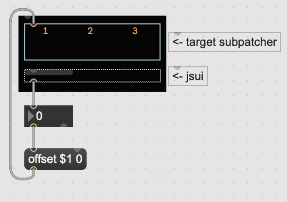

## What is this?
A script for `jsui` object in Max/Msp. 

## Requirements
Max 6.14 or higher. (confirmed version. It would work in any of your Max environment actually.)

## Usage
1. Put jsui-scrollbar.js (add to your project if you make M4L device)
1. Make a new object (`n` key) and type  `jsui jsui-scrollbar.js (whole width of target subpathcer) (width of scrollbar area)`
1. Connect patch from the outlet of jsui to `offset` message it leads to the target `bpatcher`'s inlet that follows to `thispatcher`.

## Arguments of jsui
1. Whole width of target subpatcher.
1. Width of scrollbar area.
1. Draw vertical bar when 1, otherwise horizontal. [*TODO*]

## Input Messages
float value will set offset value. [*TODO*]

## Output
`jsui` has only one outlet and it outputs integer number for offset value of the target subpatcher.